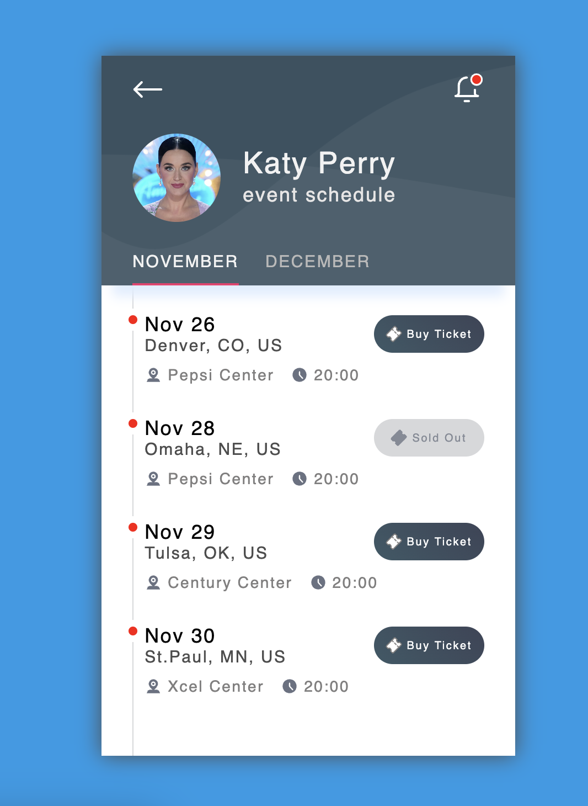

# Event Schedule Component

## Table of contents

- [Links](#links)
- [Screenshot](#screenshot)
- [My process](#my-process)
  - [Built with](#built-with)
- [Author](#author)

**Note: Delete this note and update the table of contents based on what sections you keep.**

## Overview

### Links

- Live Demo: [https://aaronkagandev-event-schedule.netlify.app/](https://aaronkagandev-event-schedule.netlify.app/)

### Screenshot

## My process

### Built with

- Semantic HTML
- SCSS
- Flexbox
- Mobile-first workflow

## Author

- Portfolio - [aaronkagan.dev](https://www.aaronkagan.dev)
- Linkedin - [/aaron-kagan](https://www.linkedin.com/in/aaron-kagan/)
- X - [@aaronkagandev](https://www.twitter.com/aaronkagandev)
- Instagram - [aaronkagandev](https://www.instagram.com/aaronkagandev/
